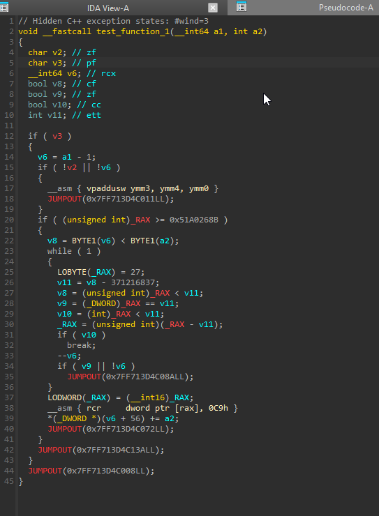
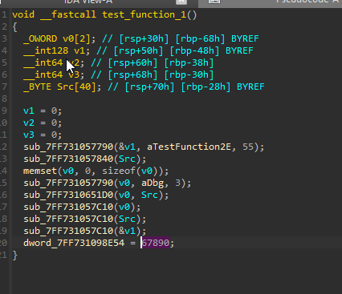

# DPE

Dynamic Page Encryption, a Windows C++ proof of concept inspired by the idea of Roblox's page-based anti-dump protection.

The idea is simple: keep code encrypted while it isn't being used. When execution reaches an inaccessible page, a vectored exception handler decrypts it and lets execution continue. A memory snapshot taken while a page is encrypted gives a disassembler garbage to work with.

## What it looks like

IDA trying to decompile encrypted bytes:



Unprotected code, for comparison:



These are the original screenshots supplied with the project. DPE changes the bytes in memory; the strange branches and instructions are IDA trying to interpret those bytes as code.

## How it works

`PageProtection` reads the running executable's PE section table and selects `.text` and sections whose names start with `.test_`. The handler and protection routines live in a separate `.prot` section so they can run while the other code is inaccessible.

At startup, it generates a 256-byte key from timestamp-counter samples, XORs each selected page with that repeating key, and marks the page `PAGE_NOACCESS`. The page size comes from Windows.

When a read or instruction fetch hits one of those pages:

1. Windows delivers an access violation to the handler.
2. If two pages are already decrypted, DPE XORs the oldest one again and marks it inaccessible.
3. It makes the requested page writable, XORs it back to its original bytes, then switches it to `PAGE_EXECUTE_READ` and flushes the instruction cache.
4. The handler returns `EXCEPTION_CONTINUE_EXECUTION`, letting the faulting instruction retry.

There are **two decrypted pages at a time**, kept in first-in, first-out order. Accessing an already active page doesn't refresh its position. Pages stay decrypted until eviction or shutdown; there is no single-step handler encrypting them after every instruction. Writes remain access violations.

Shutdown restores the code before removing the handler. Repeated initialization and shutdown calls are supported. If a protection change fails after code mutation has started, the process fails fast instead of continuing with inconsistent page state.

## Running it

Use Visual Studio 2022 with the Desktop development with C++ workload, the v143 toolset, and a Windows SDK. Open `DPE.sln` and select **Release / x64**. This is the configuration checked for this demo; debug instrumentation can introduce calls into protected code from inside the handler.

From a Visual Studio developer shell:

```powershell
msbuild DPE.sln /p:Configuration=Release /p:Platform=x64
.\Build\Binaries\DPE.exe
```

The demo calls three functions in separate `.test_` sections, prints an encrypted byte preview every two seconds, and reports fault counts and active page addresses every second. Press **F12** to restore the code and exit. Logs go to `Documents\DPE POC\Logs`.

The byte preview preserves the page's state. If the page is active, it computes the encrypted representation without changing the executable bytes.

For the automated checks:

```powershell
$test = Start-Process .\Build\Binaries\DPE.exe -ArgumentList --self-test -Wait -PassThru
$test.ExitCode
```

An exit code of `0` means the checks passed. They cover protected execution, eviction, active and cross-page byte previews, query hooks, write-fault rejection, and repeated startup/shutdown with byte restoration.

## Limits

This is a small experiment, not complete dump prevention. The executable on disk is unchanged. Active pages are plaintext, and code can be recovered by observing it as it runs. The repeating XOR key lives in the process and isn't cryptographically secure.

The optional `VirtualQuery` and `VirtualQueryEx` IAT hooks only affect matching imports in this executable. They report protected addresses as inaccessible; they don't intercept another process's queries or block an external dumper.

The demo uses cooperative fibers on one thread. The handler's spinlock serializes page changes, but it cannot stop another thread from executing a page being encrypted. Concurrent execution of protected code is unsupported. Protecting all of `.text` also means runtime and logging code can cause page churn, so fault counts aren't just counts of calls to the three test functions.
